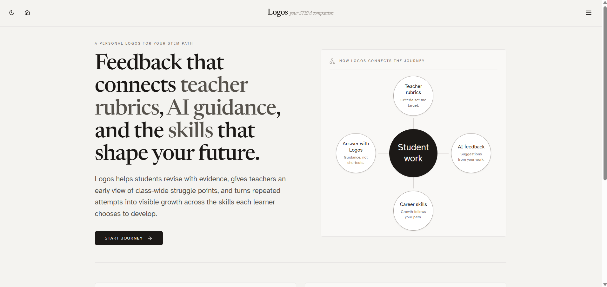
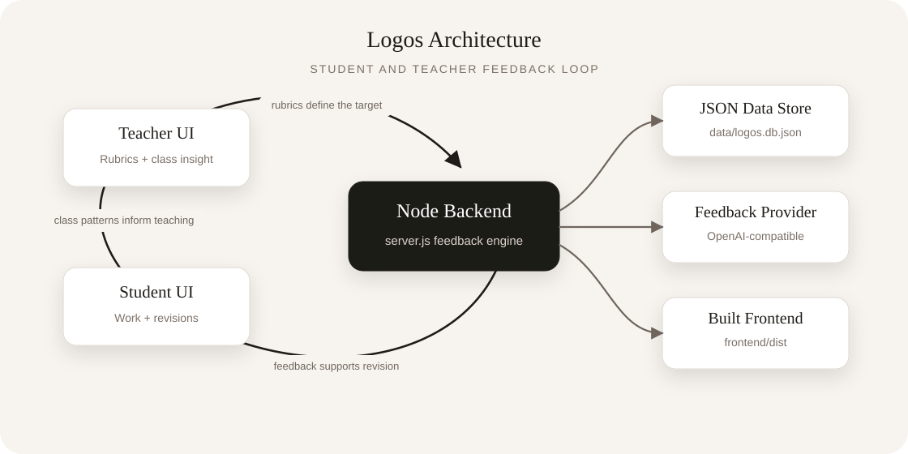
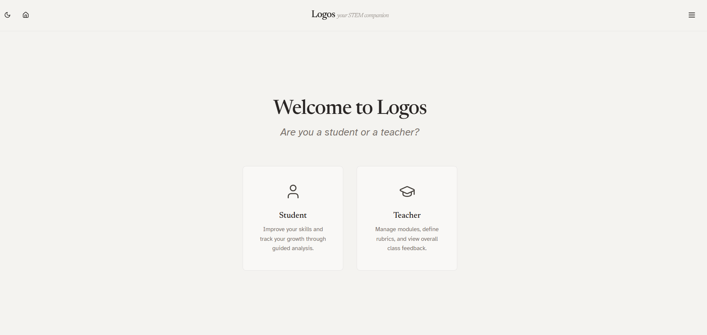
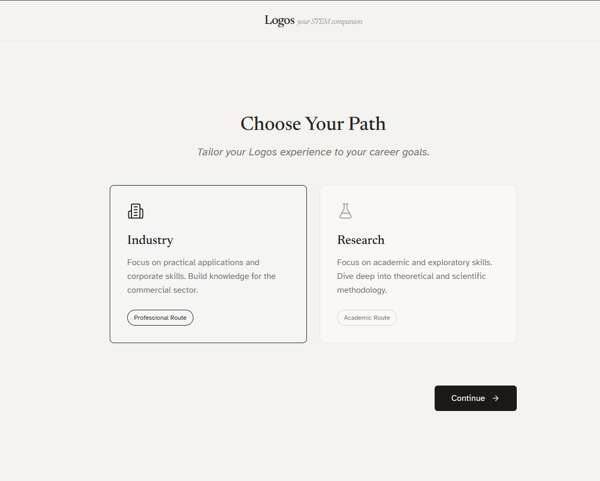
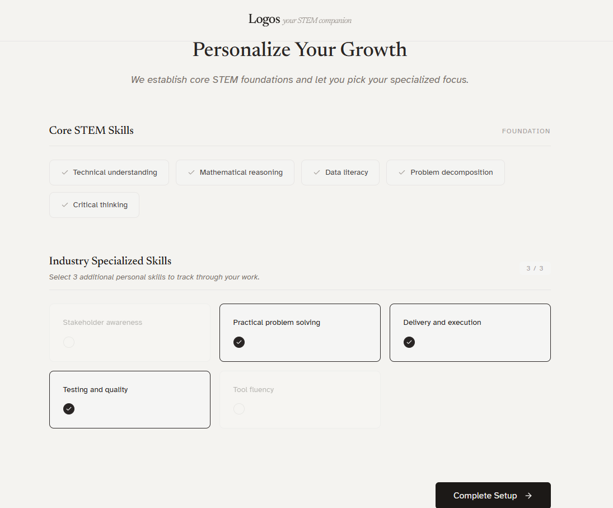
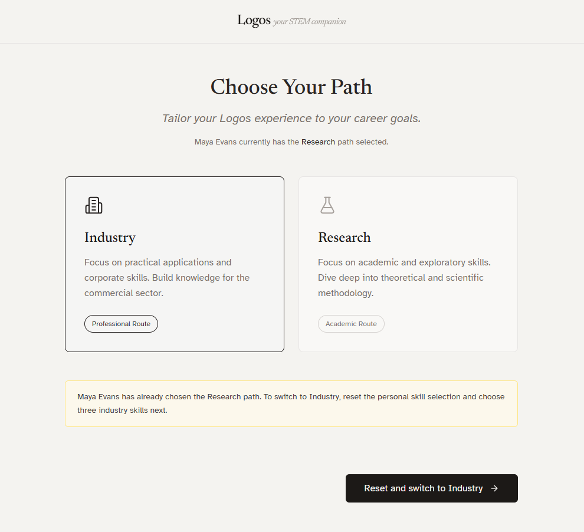
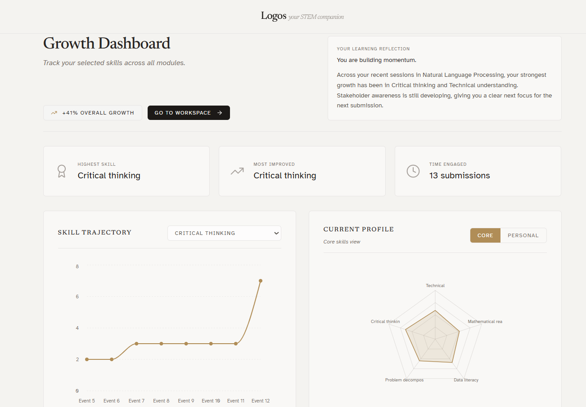
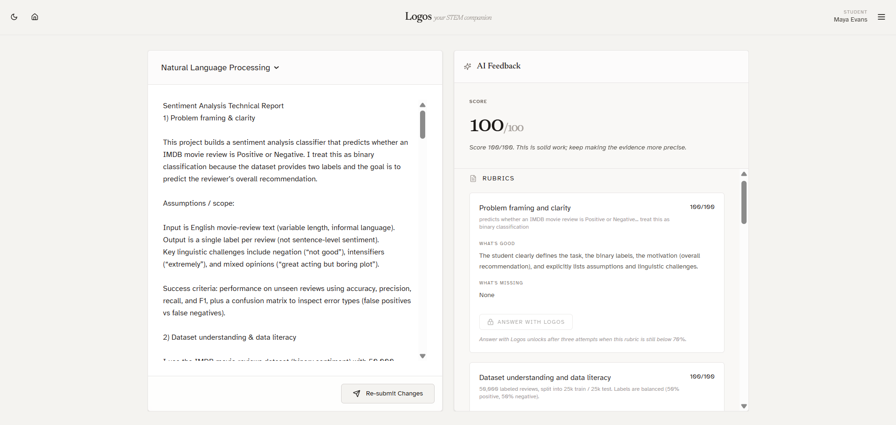
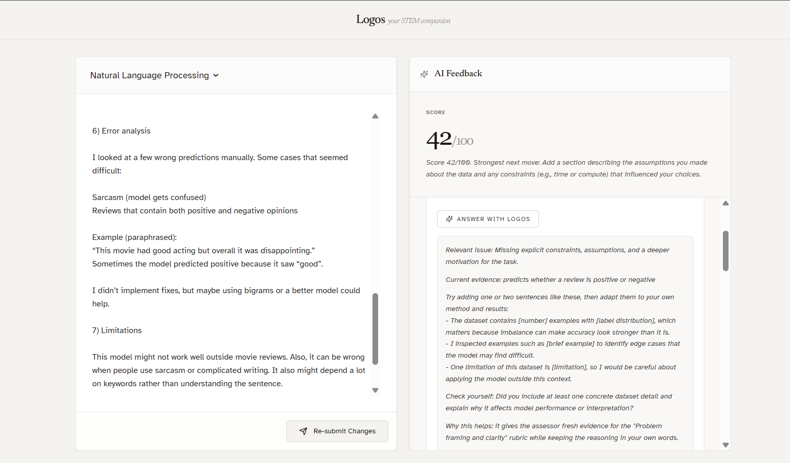
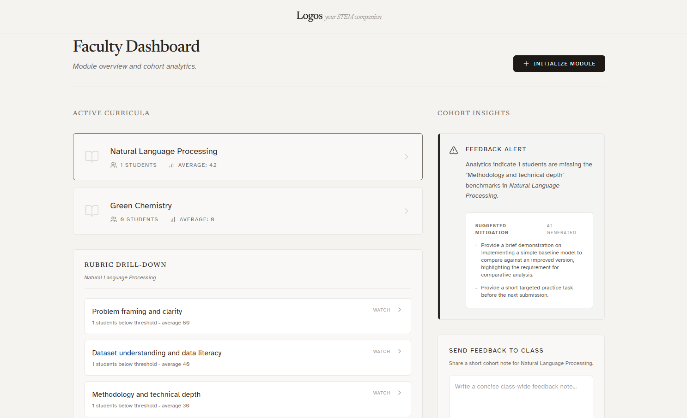

# Logos - Your STEM Companion

**Team name:** Team 8: TriNova




Logos is a STEM learning companion that connects teacher rubrics, AI-guided feedback, student revision, and visible skill growth.

## Grand Challenge

Logos addresses **Grand Challenge 4: AI-Powered Peer Feedback Coach for STEM Outputs**.

The challenge asks for AI-powered feedback systems that help learners, educators, and peers provide high-quality, accurate, and constructive feedback on STEM work. Logos focuses on STEM submissions where students need more than a score: they need help checking their reasoning, evidence, assumptions, methodological choices, clarity, and next revision steps.

## Problem And Solution

Students often receive feedback too late, too generally, or without a clear link to the skills they are trying to develop. In STEM contexts, this can make it difficult to see whether the issue is calculation, evidence, reasoning, methodology, communication, or a missing intermediate step. It can also make students feel like STEM progress belongs to a generic standard rather than their own journey, interests, and emerging identity as learners. Teachers also need a faster way to see class-wide misunderstanding across rubric criteria without manually reviewing every trend.

Logos provides:

- **AI-powered feedback:** Rubric-based analysis of student submissions, grounded in teacher criteria and the student's own work.
- **Student-Teacher collaboration:** Teacher-created modules and saved rubrics that define the standard students revise against.
- **Constructive revision:** Student workflows for repeated attempts, reflection, and clearer reasoning over time.
- **Belongingness:** Personal skill growth tracking based on meaningful rubric improvement, helping students see their own journey through STEM rather than comparing their path to someone else's.
- **Class-wide collaboration:** Teacher dashboard insights showing common weak rubric areas so educators can respond to shared misconceptions.
- **Guidance without shortcuts:** Targeted `Answer with Logos` support that gives sentence starters and self-checks without writing the full answer for the student.
- **Transparent assessment:** Criterion-level scoring that identifies evidence, missing elements, and specific revision moves.
- **Effort recognition:** A Growth Dashboard that recognises repeated attempts, visible skill movement, selected personal skills, and a short learning reflection connected to the learner's chosen STEM path.

## Technology Stack

- **Frontend:** React, Vite, TypeScript, Tailwind CSS, Recharts, Motion, Lucide icons
- **Backend:** Node.js HTTP server
- **Data storage:** JSON persistence in `data/logos.db.json`
- **AI integration:** OpenAI-compatible chat completion API, configurable through environment variables
- **Build tools:** npm, Vite

The frontend is organised into route-level screens, reusable layout components, shared services, and typed data contracts. The backend keeps the MVP intentionally focused: a single Node API serves student, teacher, feedback, and persistence workflows, with deterministic fallback behaviour when live AI access is unavailable. File upload parsing is isolated in `frontend/src/services/fileText.ts` so document handling remains separate from the workspace UI.

AI feedback is grounded in teacher-authored criteria, student work, rubric evidence, and safe revision prompts. Logos is designed as a feedback coach, not an answer generator: it helps students explain reasoning, question assumptions, validate intermediate steps, and improve clarity.

## Architecture



## Directory Structure

```text
.
|-- data/
|   `-- logos.db.json              # Active JSON database for MVP persistence
|-- doc/
|   |-- architecture-flowchart.svg  # Architecture image used in this README
|   `-- rubric_nlp.md              # Example rubric documentation
|-- frontend/
|   |-- src/
|   |   |-- main.tsx                # React entrypoint
|   |   |-- app/
|   |   |   |-- App.tsx             # React app shell
|   |   |   |-- routes.tsx          # Client-side routes
|   |   |   `-- components/         # Landing, student, teacher, and UI components
|   |   |-- hooks/                  # Frontend hooks
|   |   |-- services/               # API client and file parsing helpers
|   |   `-- styles/                 # Fonts, theme, Tailwind entrypoints
|   |-- ATTRIBUTIONS.md             # Frontend attribution notes
|   |-- index.html                  # Vite HTML entrypoint
|   |-- package.json                # Frontend dependencies
|   |-- package-lock.json           # Frontend dependency lockfile
|   |-- postcss.config.mjs          # PostCSS/Tailwind pipeline config
|   |-- README.md                   # Frontend-specific generated README
|   |-- vite.config.ts              # Vite configuration
|   `-- .env.example                # Frontend environment template
|-- server.js                       # Backend API and static file server
|-- package.json                    # Root scripts
|-- requirements.txt                # Setup notes for this Node/npm project
|-- .gitignore                      # Ignored local/generated files
`-- .env.example                    # Backend environment template
```

Generated or local-only folders such as `frontend/dist/`, `frontend/node_modules/`, and the root `.env` file are intentionally not part of the source tree to commit.

## Installation And Setup

### Prerequisites

- Node.js 20 or newer
- npm 10 or newer

### 1. Clone the repository

```bash
git clone <your-repository-url>
cd MoRPh
```

### 2. Install frontend dependencies

```bash
npm --prefix frontend install
```

### 3. Configure environment variables

Copy the example file and fill in values locally:

```bash
cp .env.example .env
```

Do not commit `.env`.

For local deterministic fallback scoring, use:

```env
BRAIN_MODE=auto
```

For strict AI grading, configure:

```env
BRAIN_MODE=openai
OPENAI_API_KEY=your_api_key_here
OPENAI_MODEL=your_model_here
OPENAI_API_URL=https://api.openai.com/v1/chat/completions
```

### 4. Start the app

From the repository root:

```bash
npm start
```

The app runs at:

```text
http://localhost:3000
```

### 5. Check/build the project

```bash
npm run check
```

## Usage Guide

Logos is designed around a shared feedback loop: teachers define the standard, students revise against that standard, and the system surfaces both individual growth and class-wide struggle patterns. The student experience emphasises constructive revision and belonging through evidence-based reflections. Personal skill tracking helps each learner connect progress to their own STEM journey, career interests, and reasons for learning, while the teacher experience supports earlier intervention when many learners miss the same idea.

### Student Flow

1. Open the app.
2. Click **Start journey**.
3. Log in as a student.
4. Choose an industry or research pathway if prompted.
5. Select personal skills.
6. Review the **Growth Dashboard**.
7. Click **Go to workspace**.
8. Select a module.
9. Type, paste, or upload work.
10. Submit for AI analysis.
11. Review:
    - overall score
    - summary
    - rubric-by-rubric feedback
    - `Answer with Logos` guidance when unlocked

### Teacher Flow

1. Log in as a teacher.
2. Create or select a module.
3. Add syllabus/objective context.
4. Upload or edit rubrics.
5. Save rubrics to the module.
6. Open the faculty dashboard.
7. Review cohort insights, weak rubric areas, and mitigation guidance.
8. Optionally send feedback to the class.

## Screenshots

### Landing And Entry Flow











### Student Experience








### Teacher Experience




## Demo Video

Demo video link: **TBD**

Add the final demo video URL here before submission.

## Team Members

| Team member | GitHub |
| --- | --- |
| Riya Kumar | TBD |
| Muhammed Farizan | [babehgobber](https://github.com/babehgobber) |
| Pooja Hiremath | [scriptsherlock](https://github.com/scriptsherlock) |

## Sample Data And Test Cases

The repository includes:

- `data/logos.db.json` - MVP data store with sample modules, rubrics, users, submissions, feedback, and growth events.
- `doc/rubric_nlp.md` - NLP rubric reference used to validate the feedback workflow.
- `doc/architecture-flowchart.svg` - architecture diagram used in this README.

Validation command:

```bash
npm run check
```

Suggested manual test cases:

- Student can start the journey, complete pathway/skill selection, land on the Growth Dashboard, and open the workspace.
- Student can submit typed or uploaded work and receive rubric-level feedback.
- `Answer with Logos` produces new revision support instead of repeating the same missing-evidence hint.
- Growth Dashboard shows capped recent submissions and growth events, with an option to expand more.
- Teacher can create or edit a module rubric, view class struggle patterns, and send class feedback.
- App runs with `BRAIN_MODE=auto` without an API key, and with `BRAIN_MODE=openai` when valid credentials are supplied locally.

## Documentation

Technical and product evidence is kept in:

- `README.md` - project overview, setup, architecture, usage, test cases, and security notes.
- `requirements.txt` - Node/npm setup notes for submission checklists and teammates.
- `doc/rubric_nlp.md` - sample rubric used to validate the feedback workflow.
- `doc/architecture-flowchart.svg` - architecture flowchart embedded above.

## Configuration

Sensitive configuration belongs in `.env`.

Use `.env.example` as the template. Do not commit real API keys or credentials.

Important variables:

- `PORT`
- `LOGOS_DB_PATH`
- `BRAIN_MODE`
- `OPENAI_API_KEY`
- `OPENAI_MODEL`
- `OPENAI_API_URL`

## Security Note

Do **not** upload API keys, credentials, or sensitive information to the repository.

This repository ignores `.env`. Commit only `.env.example`, which documents the required environment variables without secrets.

## License

License: **TBD**

Add the final project license before public release or submission.
